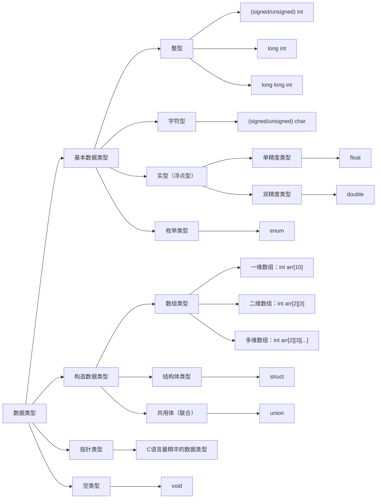

# Phase_2-_Enterprise_level_C_Language
黄埔编程第2期 企业级C语言

## 00 - 课程介绍
- 主要是C语言课程内容的介绍，包括我们需要学习的内容，课程安排等
- [课程介绍视频](https://www.bilibili.com/video/BV1gdBvBjE69/?p=1)

## 01 - 程序-算法-流程图
- 主要介绍程序、算法、流程图的概念
- [课程视频](https://www.bilibili.com/video/BV1QMByBuEeX/?p=2)
- [程序练习](01_program_algorithm_flowchart/hello_world.c)
- 编译命令: 
```shell
gcc hello_world.c -o hello_world
```
- 运行命令:
```shell
./hello_world
```

## 02 - C语言的注释
- 主要介绍C语言中的注释和使用
- [课程视频](https://www.bilibili.com/video/BV1PfvyBsEmQ/?p=2)
- [程序练习](02_c_language_comment)
- 单行注释
```shell
// 这是一个单行注释
```

- 多行注释
```shell
/* 这是一个多行注释 */
```

- 文件头注释
```shell
/******************************************************************************
* 版  权： 
* 文件名： 
* 功  能： 
* 作  者： 
* 版  本： 
* 日  期： 
******************************************************************************/
```

- 函数的注释
```shell
/******************************************************************************
 @brief      : 
 @param[in]  : 
 @param[out] : 
 @return     : 
 @note       : 
 *****************************************************************************/
```

## 03 - 常量和变量的定义和使用
- 主要介绍常量和变量的定义和使用
- [课程视频](https://bilibili.com/video/BV1e1vxBnEaV/?p=3)
- [程序练习](03_constant_variable_define)
### 3.1 常量概念和定义
常量：在程序执行过程中，其值不发生改变的量称为常量。在程序中，常量可以不经说明而直接使用。
常量分类：
1. 直接常量(字面常量/字面值)，对应数据类型的常量，包括：
整型常量: 12U、0L、-3
实型常量: 4. 6F、-1.23
字符常量: 'a' 、'b'
字符串常量: "Hello C!"
2. 符号常量，符号常量定义成宏的形式:
```c
#define 符号常量 值
```

*注:* 常量不可修改！

- 符号常量的特点：
符号常量与变量不同，它的值在其作用域内不能改变，也不能再被赋值。
- 使用符号常量的好处：
1、含义清楚；
2、能做到“一改全改"。

### 3.2 变量的概念、声明、初始化和定义
- 变量的概念
变量：在程序执行过程中，其值可以改变的量称为变量。
1. 一个变量应该有一个名字，在内存中占据一定的存储单元。
2. 变量定义必须放在变量使用之前，一般放在函数体的开头部分。
3. 要区分变量名和变量值是两个不同的概念。

- 变量的声明
变量的声明：主要是告诉编译器变量的类型和名字，在使用之前知道有这样一个变量的存在，它并不分配存储空间。

**格式：** *数据类型* 变量名;
```c
int a; // 变量a的声明(声明性定义)
```

- 变量的定义和初始化
变量的定义：为变量分配存储空间，同时指明变量的类型和名字。
**格式：** *数据类型* 变量名=变量值;
```c
int a = 10; // 变量a的定义和初始化
```

- 变量定义和声明的区别
1、变量的声明和定义主要区别在于是**否分配存储空间**。在C语言中，真正的声明使用extern 关键字进行声明(*不建议使用extern 关键字*)，此方式叫引用性声明；
```c
extern int a; // 变量a的引用性声明,不分配存储空间
```

2、在C语言中，变量有且只能定义一次，但是声明可以声明多次。
```c
extern int a; // 正确，变量a的引用性声明
extern int a; // 正确，变量a的引用性声明
```

## 04 - 数据类型
- 数据类型的概念和分类
- [课程视频](https://www.bilibili.com/video/BV1EErFBvEX6/?p=4)
- [程序练习](04_base_data_type)
### 4.1 数据类型的概念
- 数据类型概念：
是按被定义变量的性质，表示形式，占据存储空间的多少，构造特点来划分的。
- 数据类型分类：
在C语言中，数据类型可分为：基本数据类型、构造数据类型、指针类型、空类型四大类型。
C语言中有自带的数据类型，也可以自定义数据类型，如union、struct。



- 基本数据类型
基本数据类型最主要的特点是其值不可以再分解为其它类型，也就是说，基本数据类型是自我说明的。
- 构造类型
构造类型是根据已定义的一个或多个数据类型用构造的方法来定义的。也就是说，一个构造类型的值可以分解成若干个“成员”或“元素”。每个“成员”都是一个基本数据类型或又是一个构造类型。
- 指针类型
指针是一种特殊的，同时又是具有重要作用的数据类型。其值用来表示某个变量在内存中的地址。
- 空类型
类型说明符为void，一般用于函数的返回类型，表示函数无返回值，也可以用于存储没有指定具体数据类型的数据。

## 05 - 整型的概念和分类
- [课程视频](https://www.bilibili.com/video/BV1VbrFBZEbJ/?p=5)
- [程序练习](05_integer)
- 整型的概念
整型数据在内存中的存放形式是以补码表示的。
(1).正数的补码和原码相同；
(2).负数的补码：第一位是符号位，除符号位外每一位求反后加1。

举例：

定义一个整型变量 `int positive_number = 10`，以32位系统为例，在内存中的存放形式为：

| 0 | 0 | 0 | 0 | 0 | 0 | 0 | 0 | 0 | 0 | 0 | 0 | 0 | 0 | 0 | 0 | 0 | 0 | 0 | 0 | 0 | 0 | 0 | 0 | 0 | 0 | 0 | 0 | 1 | 0 | 1 | 0 |
|---|---|---|---|---|---|---|---|---|---|---|---|---|---|---|---|---|---|---|---|---|---|---|---|---|---|---|---|---|---|---|---|


定义一个整型变量 `int negative_number = -10`，以32位系统为例，在内存中的存放形式为：

| 1 | 1 | 1 | 1 | 1 | 1 | 1 | 1 | 1 | 1 | 1 | 1 | 1 | 1 | 1 | 1 | 1 | 1 | 1 | 1 | 1 | 1 | 1 | 1 | 1 | 1 | 1 | 1 | 0 | 1 | 1 | 0 |
|---|---|---|---|---|---|---|---|---|---|---|---|---|---|---|---|---|---|---|---|---|---|---|---|---|---|---|---|---|---|---|---|

- 整型数据在内存中的存放形式

代码示例
```c
/******************************************************************************
 * 版  权： 版权归作者个人所有
 * 文件名： main.c
 * 功  能： 整型数据类型的定义和使用示例
 * 作  者： 校长
 * 版  本： V1.0
 * 日  期： 2026/01/11
 ******************************************************************************/
#include <stdio.h>         // 包含的系统头文件

int main(int argc, char** argv)
{
    int positive_integer = 10;      // 定义一个正整数变量
    int negative_integer = -10;     // 定义一个负整数变量
    return 0;
}

```

进行gdb反汇编查看，步骤如下：
（1）编译出带gdb调试信息的二进制文件命令如下：
```shell
gcc -g -o main.bin main.c
```

（2）进入gdb调试进行查看：
gdb ./main.bin
（3）然后逐条查看C语言对应的汇编语言的代码，命令如下：
(gdb)display /i  $pc
(gdb)b main
(gdb)s
(gdb)s
结果如下：
```shell
$ gdb ./main.bin 
GNU gdb (Ubuntu 15.0.50.20240403-0ubuntu1) 15.0.50.20240403-git
Copyright (C) 2024 Free Software Foundation, Inc.
License GPLv3+: GNU GPL version 3 or later <http://gnu.org/licenses/gpl.html>
This is free software: you are free to change and redistribute it.
There is NO WARRANTY, to the extent permitted by law.
Type "show copying" and "show warranty" for details.
This GDB was configured as "x86_64-linux-gnu".
Type "show configuration" for configuration details.
For bug reporting instructions, please see:
<https://www.gnu.org/software/gdb/bugs/>.
Find the GDB manual and other documentation resources online at:
    <http://www.gnu.org/software/gdb/documentation/>.

For help, type "help".
Type "apropos word" to search for commands related to "word"...
Reading symbols from ./main.bin...
(gdb) display /i $pc
1: x/i $pc
<error: No registers.>
(gdb) b main
Breakpoint 1 at 0x1138: file main.c, line 13.
(gdb) r
Starting program: /home/l12345678/cloud/code/Phase_2_Enterprise_level_C_Language/05_interger/main.bin 

This GDB supports auto-downloading debuginfo from the following URLs:
  <https://debuginfod.ubuntu.com>
Enable debuginfod for this session? (y or [n]) y
Debuginfod has been enabled.
To make this setting permanent, add 'set debuginfod enabled on' to .gdbinit.
Downloading separate debug info for system-supplied DSO at 0x7ffff7fc3000
[Thread debugging using libthread_db enabled]                                                                                                                                                           
Using host libthread_db library "/lib/x86_64-linux-gnu/libthread_db.so.1".

Breakpoint 1, main (argc=1, argv=0x7fffffffe258) at main.c:13
13        int positive_integer = 10;      // 定义一个正整数变量
1: x/i $pc
=> 0x555555555138 <main+15>:    movl   $0xa,-0x8(%rbp)
(gdb) s
14        int negative_integer = -10;     // 定义一个负整数变量
1: x/i $pc
=> 0x55555555513f <main+22>:    movl   $0xfffffff6,-0x4(%rbp)
(gdb) s
15        return 0;
1: x/i $pc
=> 0x555555555146 <main+29>:    mov    $0x0,%eax
(gdb) s
16    }
1: x/i $pc
=> 0x55555555514b <main+34>:    pop    %rbp
(gdb) p &positive_integer
$1 = (int *) 0x7fffffffe128
(gdb) p &negative_integer
$2 = (int *) 0x7fffffffe12c
(gdb) exit
A debugging session is active.

    Inferior 1 [process 4021] will be killed.

Quit anyway? (y or n) y

```
